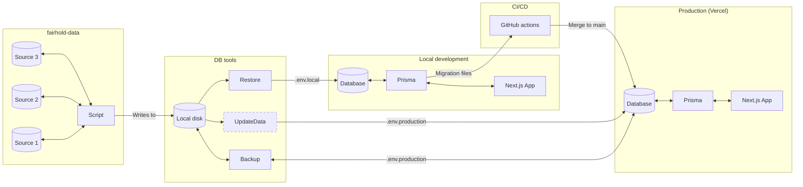

This is a [Next.js](https://nextjs.org/) project bootstrapped with [`create-next-app`](https://github.com/vercel/next.js/tree/canary/packages/create-next-app).

## Getting Started

First, run the development server:

```bash
npm run dev
# or
yarn dev
# or
pnpm dev
# or
bun dev
```

Open [http://localhost:3000](http://localhost:3000) with your browser to see the result.

You can start editing the page by modifying `app/page.tsx`. The page auto-updates as you edit the file.

This project uses [`next/font`](https://nextjs.org/docs/basic-features/font-optimization) to automatically optimize and load Inter, a custom Google Font.

## Learn More

To learn more about Next.js, take a look at the following resources:

- [Next.js Documentation](https://nextjs.org/docs) - learn about Next.js features and API.
- [Learn Next.js](https://nextjs.org/learn) - an interactive Next.js tutorial.

You can check out [the Next.js GitHub repository](https://github.com/vercel/next.js/) - your feedback and contributions are welcome!

## Deploy on Vercel

The easiest way to deploy your Next.js app is to use the [Vercel Platform](https://vercel.com/new?utm_medium=default-template&filter=next.js&utm_source=create-next-app&utm_campaign=create-next-app-readme) from the creators of Next.js.

Check out our [Next.js deployment documentation](https://nextjs.org/docs/deployment) for more details.


## Architecture


## Calculator docs
See our [Github Wiki](https://github.com/theopensystemslab/fairhold-dashboard/wiki) for data sources and decisions around why we calculate things a certain way.

## Data update
1. Download the latest relevant datasets. A list of all sources can be found in the [Wiki](https://github.com/theopensystemslab/fairhold-dashboard/wiki/Data).
NB: we now use the most recent release per-dataset, which means that years are inconsistent. 
2. Clone the [fairhold-data](https://github.com/theopensystemslab/fairhold-data) repo and put relevant datasets into their relevant directories, update any file names / paths as well as any column names or data shapes, if they have changed. Run `main.py` to generate all of the relevant CSVs. 
3. Run `convertToSQL.py` to generate SQL that can be run against the database. 
4. Update your local dev database by manually running all of the SQL, truncating tables first. (There is a backup of all the SQL in the Fairhold GDrive, which we didn't want to commit directly to the repo). You can do this in pgAdmin, using the variables in `.env.local` (see Fairhold 1Password vault). The `prices_paid` dataset is best run by copying straight from a CSV, since it's so large. 
On windows, you'll have to copy the file into Docker _from Powershell_ to update the data in your local db: `docker cp "path\to\your\csv\prices_paid.csv" fairhold-dashboard-postgres-1:/tmp/prices_paid.csv`.
A success message should show.
You can then connect to the db by running `psql -h localhost -p 5400 -U <username> -d <database>`. 
Then, from `COPY prices_paid FROM '/tmp/prices_paid.csv' WITH (FORMAT csv, HEADER true);`
5. Run `prisma:pull`, `prisma:generate` and `prisma:studio` to confirm that all data has been updated as expected. 
6. Check that all tests pass 
7. If all is well, run the same SQL on production. 